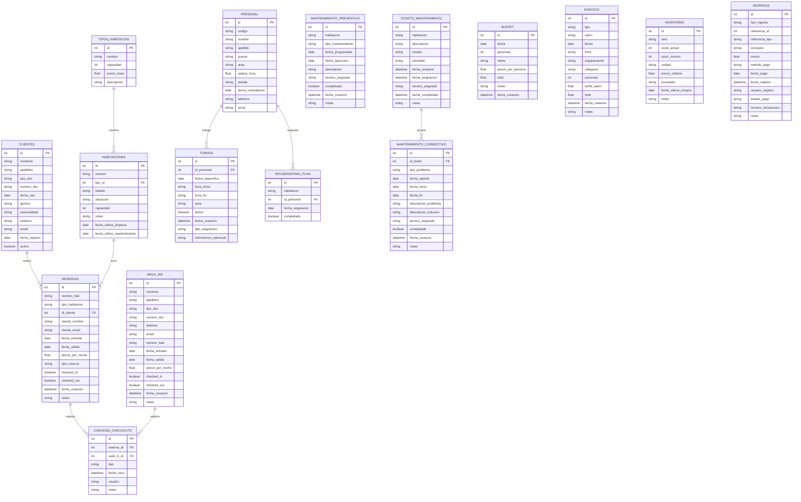

# PMSHotel
Sistema de Gestión Hotelera (PMS) desarrollado en Python con interfaz gráfica moderna usando CustomTkinter.

## Descripción
Este software es un sistema integral de gestión hotelera que permite la administración completa de un hotel, integrando múltiples módulos especializados:

### Módulos Principales
- **📊 Dashboard:** Panel de control con KPIs en tiempo real, métricas de ocupación, ingresos y acciones rápidas
- **👥 Gestión de Clientes:** Registro completo, edición, búsqueda avanzada y gestión de huéspedes con validación de datos
- **🏠 Gestión de Habitaciones:** Administración completa del inventario de habitaciones con tipos, estados y mantenimiento
- **📅 Gestión de Reservas:** Sistema completo de reservas con búsqueda de disponibilidad, check-in/check-out y gestión de walk-ins

### Características Avanzadas
- **Sistema de KPIs:** Métricas en tiempo real de ocupación, ingresos mensuales, reservas activas y personas alojadas
- **Gestión de Personal:** Administración de empleados, turnos y asignaciones por área
- **Mantenimiento:** Sistema de tickets, mantenimiento preventivo y correctivo
- **Eventos y Buffets:** Gestión de eventos corporativos, bodas y servicios de catering
- **Inventario:** Control de stock de suministros y productos del hotel
- **Ingresos:** Registro detallado de todos los ingresos con múltiples métodos de pago
- **Check-in/Check-out:** Sistema automatizado de entrada y salida de huéspedes

La aplicación utiliza una base de datos local SQLite (`base_datos.db`) con 16 tablas interconectadas para un manejo completo de la información hotelera.

## Requisitos del Sistema
- **Python:** 3.8 o superior
- **Sistema Operativo:** Windows, macOS, Linux
- **Memoria RAM:** Mínimo 512MB, recomendado 1GB
- **Espacio en disco:** 50MB para la aplicación + espacio para base de datos

### Dependencias Principales
- `customtkinter` - Interfaz gráfica moderna
- `tkinter` - Framework de GUI (incluido con Python)
- `tkcalendar` - Widget de calendario para fechas
- `email-validator` - Validación de correos electrónicos
- `sqlite3` - Base de datos (incluido con Python)

### Instalación de Dependencias
```bash
pip install customtkinter tkcalendar email-validator
```

**Nota:** Se recomienda usar un entorno virtual para evitar conflictos de dependencias.

## Instalación y Ejecución

### Pasos para ejecutar el sistema:

1. **Clonar o descargar el proyecto**
2. **Instalar dependencias:**
   ```bash
   pip install customtkinter tkcalendar email-validator
   ```
3. **Ejecutar la aplicación:**
   ```bash
   python main.py
   ```

### Primera ejecución
- La base de datos se crea automáticamente al iniciar
- Se pueden insertar datos de muestra desde el Dashboard
- El sistema incluye datos de prueba para demostrar todas las funcionalidades

### Características de la Interfaz
- **Diseño responsivo:** Se adapta a diferentes tamaños de pantalla
- **Tema claro:** Interfaz moderna con colores profesionales
- **Navegación intuitiva:** Menú lateral con acceso rápido a todos los módulos
- **Pantalla completa:** Opción de ejecutar en modo pantalla completa

## Módulos del Sistema

### 📊 Dashboard
Panel de control principal con métricas en tiempo real y acciones rápidas.

**Características:**
- **KPIs en tiempo real:** Personas alojadas, habitaciones totales, reservas activas, ingresos del mes
- **Acciones rápidas:** Acceso directo a crear clientes, habitaciones y reservas
- **Gestión de datos:** Insertar datos de muestra y limpiar base de datos
- **Métricas visuales:** Tarjetas con colores distintivos para cada métrica

### 👥 Gestión de Clientes
Sistema completo de administración de huéspedes con validaciones avanzadas.

**Campos gestionados:**
- Información personal: Nombres, apellidos, fecha de nacimiento, género
- Documentación: Tipo y número de documento (con validación de unicidad)
- Contacto: Teléfono y email (con validación de formato y unicidad)
- Nacionalidad y fecha de registro

**Operaciones disponibles:**
- ✅ Registro de nuevos clientes con validación completa
- ✏️ Edición de datos existentes
- 🔍 Búsqueda avanzada por múltiples criterios
- 📋 Listado completo con ordenamiento
- 🗑️ Eliminación segura de registros
- 🔄 Actualización automática de la lista

### 🏠 Gestión de Habitaciones
Administración integral del inventario de habitaciones con control de estados.

**Funcionalidades principales:**
- **Gestión de Habitaciones:** CRUD completo de habitaciones
- **Tipos de Habitación:** Administración de categorías (Individual, Doble, Suite, Presidencial)
- **Estados de Habitación:** Disponible, Ocupada, Sucia, Limpiando, Mantenimiento, Fuera de Servicio
- **Filtros avanzados:** Por estado, tipo, ubicación y búsqueda por número

**Campos gestionados:**
- Número de habitación (único)
- Tipo de habitación (relacionado con tabla de tipos)
- Estado actual
- Ubicación (piso/zona)
- Capacidad máxima
- Notas internas
- Fechas de última limpieza y mantenimiento

### 📅 Gestión de Reservas
Sistema completo de reservas con múltiples funcionalidades.

**Módulos de reservas:**
- **➕ Nueva Reserva:** Creación de reservas con validación de disponibilidad
- **🔍 Buscar Disponibilidad:** Consulta de habitaciones disponibles por fechas
- **📋 Gestionar Reservas:** Administración de reservas existentes
- **📚 Historial:** Consulta de reservas históricas

**Características avanzadas:**
- **Walk-ins:** Gestión de huéspedes sin reserva previa
- **Check-in/Check-out:** Sistema automatizado de entrada y salida
- **Cálculo automático:** Precios por noche y totales
- **Validación de fechas:** Prevención de conflictos de reservas
- **Múltiples tipos:** Reservas individuales, corporativas, etc.

**KPIs específicos:**
- Reservas activas
- Habitaciones ocupadas hoy
- Check-ins pendientes
- Ingresos por reservas

## Estructura de la Base de Datos

La base de datos SQLite se crea automáticamente al iniciar el sistema e incluye **16 tablas interconectadas** para un manejo completo de la información hotelera:

### Tablas Principales

#### 👥 Gestión de Clientes
- **`clientes`** - Información completa de huéspedes
  - Campos: id, nombres, apellidos, tipo_doc, numero_doc, fecha_nac, genero, nacionalidad, telefono, email, fecha_registro, activo

#### 🏠 Gestión de Habitaciones
- **`tipos_habitacion`** - Categorías de habitaciones
  - Campos: id, nombre, capacidad, precio_base, descripcion
- **`habitaciones`** - Inventario de habitaciones
  - Campos: id, numero, tipo_id (FK), estado, ubicacion, capacidad, notas, fecha_ultima_limpieza, fecha_ultimo_mantenimiento

#### 📅 Gestión de Reservas
- **`reservas`** - Reservas programadas
  - Campos: id, numero_hab, tipo_habitacion, id_cliente (FK), cliente_nombre, cliente_email, fecha_entrada, fecha_salida, precio_por_noche, tipo_reserva, checked_in, checked_out, fecha_creacion, notas
- **`walk_ins`** - Huéspedes sin reserva previa
  - Campos: id, nombres, apellidos, tipo_doc, numero_doc, telefono, email, numero_hab, fecha_entrada, fecha_salida, precio_por_noche, checked_in, checked_out, fecha_creacion, notas

#### 👨‍💼 Gestión de Personal
- **`personal`** - Empleados del hotel
  - Campos: id, codigo, nombre, apellido, puesto, area, salario_hora, estado, fecha_contratacion, telefono, email
- **`turnos`** - Asignación de turnos
  - Campos: id, id_personal (FK), fecha_especifica, hora_inicio, hora_fin, area, activo, fecha_creacion, tipo_asignacion, informacion_adicional

#### 🔧 Mantenimiento
- **`mantenimiento_preventivo`** - Mantenimiento programado
  - Campos: id, habitacion, tipo_mantenimiento, fecha_programada, fecha_ejecucion, descripcion, tecnico_asignado, completado, fecha_creacion, notas
- **`tickets_mantenimiento`** - Tickets de mantenimiento
  - Campos: id, habitacion, descripcion, estado, prioridad, fecha_creacion, fecha_asignacion, tecnico_asignado, fecha_completado, notas
- **`mantenimiento_correctivo`** - Mantenimiento correctivo
  - Campos: id, id_ticket (FK), tipo_problema, fecha_reporte, fecha_inicio, fecha_fin, descripcion_problema, descripcion_solucion, tecnico_asignado, completado, fecha_creacion, notas

#### 🏨 Operaciones Hoteleras
- **`checkins_checkouts`** - Registro de entradas y salidas
  - Campos: id, reserva_id (FK), walk_in_id (FK), tipo, fecha_hora, usuario, notas
- **`housekeeping_plan`** - Plan de limpieza
  - Campos: id, habitacion, id_personal (FK), fecha_asignacion, completado

#### 🎉 Eventos y Servicios
- **`buffet`** - Servicios de catering
  - Campos: id, fecha, personas, menu, precio_por_persona, total, notas, fecha_creacion
- **`eventos`** - Eventos corporativos y sociales
  - Campos: id, tipo, salon, fecha, hora, equipamiento, categoria, personas, tarifa_salon, total, fecha_creacion, notas

#### 📦 Inventario y Finanzas
- **`inventario`** - Control de stock
  - Campos: id, item, stock_actual, stock_minimo, unidad, precio_unitario, proveedor, fecha_ultima_compra, notas
- **`ingresos`** - Registro de ingresos
  - Campos: id, tipo_ingreso, referencia_id, referencia_tipo, concepto, monto, metodo_pago, fecha_pago, fecha_registro, usuario_registro, estado_pago, numero_transaccion, notas

### Relaciones Principales
- Cada habitación tiene un tipo específico
- Las reservas y walk-ins se asocian con clientes y habitaciones
- El personal tiene turnos asignados por área
- Los tickets de mantenimiento generan trabajos correctivos
- Los ingresos se relacionan con reservas, walk-ins o eventos

### Diagrama de la Base de Datos



## Características Técnicas

### Funcionalidades Avanzadas
- **Validación de datos:** Email y documentos únicos con verificación automática
- **Cálculos automáticos:** Precios por noche, totales de reservas y estadísticas
- **Búsqueda inteligente:** Filtros múltiples y búsqueda por texto libre
- **Gestión de estados:** Control automático de estados de habitaciones
- **Reportes en tiempo real:** KPIs actualizados automáticamente
- **Datos de muestra:** Sistema incluye datos de prueba para demostración

### Arquitectura del Sistema
- **Frontend:** CustomTkinter para interfaz moderna y responsiva
- **Backend:** Python con SQLite para persistencia de datos
- **Patrón MVC:** Separación clara entre lógica de negocio y presentación
- **Modular:** Cada funcionalidad en módulos independientes
- **Escalable:** Estructura preparada para futuras expansiones

### Seguridad y Validación
- **Validación de entrada:** Todos los campos críticos tienen validación
- **Integridad referencial:** Claves foráneas mantienen consistencia de datos
- **Validación de email:** Verificación de formato usando email-validator
- **Documentos únicos:** Prevención de duplicados en documentos de identidad
- **Fechas válidas:** Validación de rangos de fechas en reservas

## Notas Importantes
- ✅ La base de datos se crea automáticamente al iniciar el sistema
- ✅ No es necesario ejecutar scripts SQL manualmente
- ✅ El sistema incluye datos de muestra para pruebas y demostración
- ✅ Todas las funcionalidades están implementadas y operativas, exceptuando el módulo de reservas, la cual está en proceso

## Futuras Mejoras
- 📅 Vista de calendario para reservas
- 📊 Reportes exportación de datos
- 🏨 Gestión completa de recepción, check-in/check-out
- 🍽️ Sistema de cotizaciones para buffet y eventos
- 📋 Gestión de operaciones diarias, turnos de personal, inventario en tiempo real

---
**Proyecto académico ITSC - Sistema de Gestión Hotelera**
