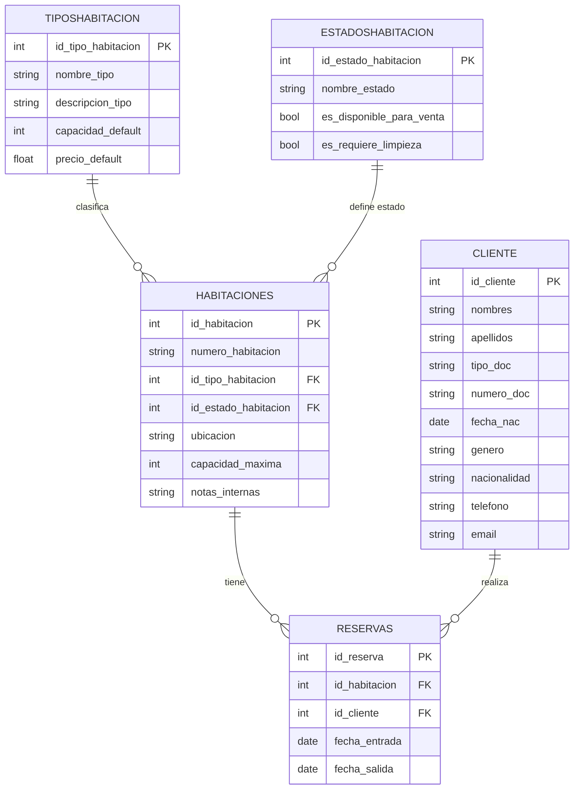

# PMSHotel
Sistema de Gestión Hotelera (PMS) desarrollado en Python con interfaz gráfica moderna.

## Descripción
Este software permite la administración de un hotel de manera sencilla, integrando:
- **Gestión de clientes:** Registro, edición, búsqueda y listado de huéspedes.
- **Gestión de habitaciones:** Alta, edición, filtrado y visualización de habitaciones, con control de estados (disponible, ocupada, sucia, mantenimiento, etc.).
- **Gestión de reservas:** Búsqueda de disponibilidad, creación y cancelación de reservas, visualización de reservas activas.

La aplicación utiliza una base de datos local SQLite (`base_datos.db`).

## Requisitos
- Python 3.8+
- Paquetes: `customtkinter`, `tkinter`, `tkcalendar`, `sqlite3`, `email-validator`

Se recomienda usar un entorno virtual.

## Ejecución
1. Instala las dependencias necesarias:
   ```bash
   pip install customtkinter tkcalendar email-validator
   ```
2. Ejecuta el sistema:
   ```bash
   python main.py
   ```

## Módulos principales

### 1. Gestión de Clientes
Permite registrar, editar, buscar, listar y eliminar huéspedes.
**Campos gestionados:**
- Nombres, Apellidos
- Tipo y número de documento
- Fecha de nacimiento
- Género
- Nacionalidad
- Teléfono
- Email (con validación de formato)

**Operaciones:**
- Alta y edición de clientes
- Búsqueda por nombre, documento, teléfono o email
- Eliminación y refresco de la lista
- Validación automática del formato de correo electrónico

### 2. Gestión de Habitaciones
Administra el inventario de habitaciones del hotel.
**Campos gestionados:**
- Número de habitación
- Tipo (Individual, Doble, Suite, etc.)
- Estado (Disponible, Ocupada, Sucia, Limpiando, Mantenimiento, Fuera de Servicio)
- Ubicación
- Capacidad máxima
- Notas internas

**Operaciones:**
- Alta, edición y eliminación de habitaciones
- Cambio de estado (por ejemplo, marcar como sucia o en mantenimiento)
- Filtros por estado, tipo, ubicación y búsqueda por número

### 3. Gestión de Reservas
Permite buscar disponibilidad, crear, visualizar y cancelar reservas.
**Campos gestionados:**
- Número de habitación
- Cliente asociado (ID)
- Fechas de entrada y salida

**Operaciones:**
- Búsqueda de habitaciones disponibles por fecha y tipo
- Creación de nuevas reservas
- Visualización y cancelación de reservas existentes

## Estructura de la Base de Datos

La base de datos es SQLite y se crea automáticamente al iniciar el sistema. Las tablas principales son:

- **cliente:**
  - id_cliente (PK), nombres, apellidos, tipo_doc, numero_doc, fecha_nac, genero, nacionalidad, telefono, email
- **TiposHabitacion:**
  - id_tipo_habitacion (PK), nombre_tipo, descripcion_tipo, capacidad_default, precio_default
- **EstadosHabitacion:**
  - id_estado_habitacion (PK), nombre_estado, es_disponible_para_venta, es_requiere_limpieza
- **Habitaciones:**
  - id_habitacion (PK), numero_habitacion, id_tipo_habitacion (FK), id_estado_habitacion (FK), ubicacion, capacidad_maxima, notas_internas
- **Reservas:**
  - (Típicamente: id_reserva (PK), id_habitacion (FK), id_cliente (FK), fecha_entrada, fecha_salida)

**Relaciones:**
- Cada habitación tiene un tipo y un estado.
- Cada reserva asocia un cliente con una habitación y un rango de fechas.

### Diagrama de la base de datos



## Notas
- La base de datos se crea automáticamente al iniciar el sistema si no existe, pero no crea todas las tablas.
- No es necesario ejecutar scripts SQL manualmente.

---
Proyecto académico ITSC
