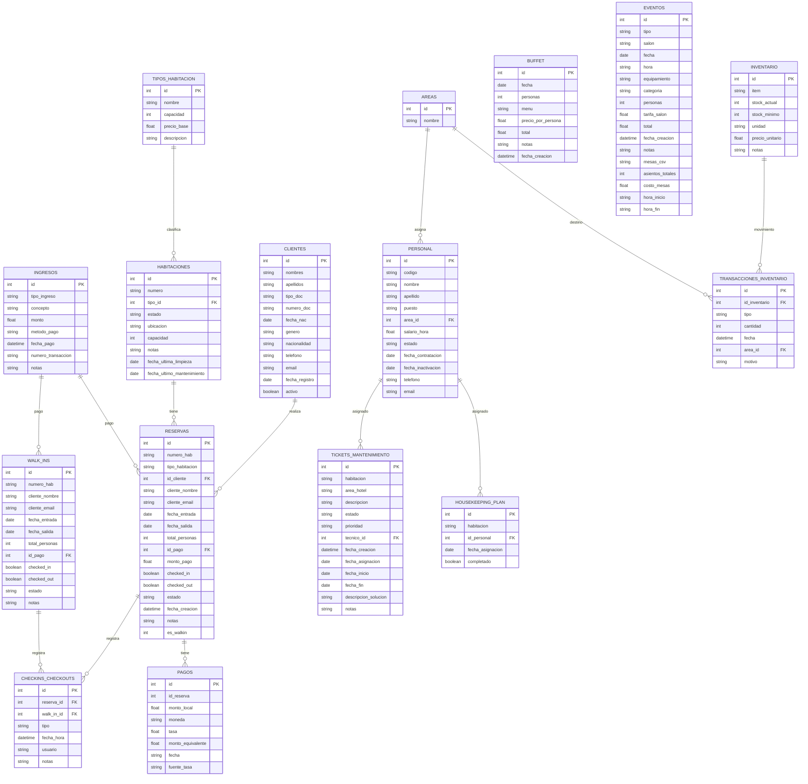

# PMSHotel
Sistema de Gestión Hotelera (PMS) desarrollado en Python con interfaz gráfica moderna usando CustomTkinter.

## Descripción
Este software es un sistema integral de gestión hotelera que permite la administración completa de un hotel, integrando múltiples módulos especializados para operaciones diarias, reservas, eventos y logística.

### Módulos Principales
- **📊 Dashboard:** Panel de control con KPIs en tiempo real, métricas de ocupación, ingresos y acciones rápidas
- **👥 Gestión de Clientes:** Registro completo, edición, búsqueda avanzada y gestión de huéspedes con validación de datos
- **🏠 Gestión de Habitaciones:** Administración completa del inventario de habitaciones con tipos, estados y mantenimiento
- **📅 Gestión de Reservas:** Sistema completo de reservas con búsqueda de disponibilidad, creación de reservas, gestión activa e historial
- **🏨 Front Desk:** Módulo de recepción con check-in, walk-ins, check-out, extensión de estadía y gestión de pagos
- **🧹 Logística:** Gestión de housekeeping, mantenimiento, inventario y personal
- **🍽️ Cotización de Buffet:** Sistema de cotización para servicios de catering con generación de PDF
- **🎉 Cotización de Eventos:** Gestión de eventos corporativos y sociales con detección de conflictos, gestión de mesas y generación de PDF

### Características Avanzadas
- **Sistema de KPIs:** Métricas en tiempo real de ocupación, ingresos mensuales, reservas activas y personas alojadas
- **Gestión de Personal:** Administración de empleados por áreas (Housekeeping, Mantenimiento, Front Desk, Cocina, Admin)
- **Mantenimiento:** Sistema de tickets con asignación de técnicos, seguimiento de estados y prioridades
- **Eventos y Buffets:** Gestión completa de cotizaciones con cálculo automático de costos, detección de conflictos de horarios y generación de PDF
- **Inventario:** Control de stock con transacciones de entrada/salida, alertas de stock mínimo y gestión por áreas
- **Ingresos:** Registro detallado de todos los ingresos con múltiples métodos de pago y conversión de monedas
- **Check-in/Check-out:** Sistema automatizado con soporte para early check-in, late check-out, check-out anticipado y extensión de estadía
- **Walk-ins:** Gestión de huéspedes sin reserva previa con registro inmediato

La aplicación utiliza una base de datos local SQLite (`base_datos.db`) con 17+ tablas interconectadas para un manejo completo de la información hotelera.

## Requisitos del Sistema
- **Python:** 3.8 o superior
- **Sistema Operativo:** Windows, macOS, Linux
- **Memoria RAM:** Mínimo 512MB, recomendado 1GB
- **Espacio en disco:** 50MB para la aplicación + espacio para base de datos

### Dependencias Principales
- `customtkinter` - Interfaz gráfica moderna
- `tkinter` - Framework de GUI (incluido con Python)
- `tkcalendar` - Widget de calendario para fechas
- `email-validator` - Validación de correos electrónicos
- `sqlite3` - Base de datos (incluido con Python)
- `reportlab` - Generación de PDFs para cotizaciones
- `requests` - Consulta de tasas de cambio para conversión de monedas

### Instalación de Dependencias
```bash
pip install customtkinter tkcalendar email-validator reportlab requests
```

**Nota:** Se recomienda usar un entorno virtual para evitar conflictos de dependencias.

## Instalación y Ejecución

### Pasos para ejecutar el sistema:

1. **Clonar o descargar el proyecto**
2. **Instalar dependencias:**
   ```bash
   pip install customtkinter tkcalendar email-validator
   ```
3. **Ejecutar la aplicación:**
   ```bash
   python main.py
   ```

### Primera ejecución
- La base de datos se crea automáticamente al iniciar
- Se pueden insertar datos de muestra desde el Dashboard
- El sistema incluye datos de prueba para demostrar todas las funcionalidades

### Características de la Interfaz
- **Diseño responsivo:** Se adapta a diferentes tamaños de pantalla
- **Tema claro:** Interfaz moderna con colores profesionales
- **Navegación intuitiva:** Menú lateral con acceso rápido a todos los módulos
- **Pantalla completa:** Opción de ejecutar en modo pantalla completa

## Módulos del Sistema

### 📊 Dashboard
Panel de control principal con métricas en tiempo real y acciones rápidas.

**Características:**
- **KPIs en tiempo real:** Personas alojadas, habitaciones totales, reservas activas, ingresos del mes
- **Acciones rápidas:** Acceso directo a crear clientes, habitaciones y reservas
- **Gestión de datos:** Insertar datos de muestra y limpiar base de datos
- **Métricas visuales:** Tarjetas con colores distintivos para cada métrica

### 👥 Gestión de Clientes
Sistema completo de administración de huéspedes con validaciones avanzadas.

**Campos gestionados:**
- Información personal: Nombres, apellidos, fecha de nacimiento, género
- Documentación: Tipo y número de documento (con validación de unicidad)
- Contacto: Teléfono y email (con validación de formato y unicidad)
- Nacionalidad y fecha de registro

**Operaciones disponibles:**
- ✅ Registro de nuevos clientes con validación completa
- ✏️ Edición de datos existentes
- 🔍 Búsqueda avanzada por múltiples criterios
- 📋 Listado completo con ordenamiento
- 🗑️ Eliminación segura de registros
- 🔄 Actualización automática de la lista

### 🏠 Gestión de Habitaciones
Administración integral del inventario de habitaciones con control de estados.

**Funcionalidades principales:**
- **Gestión de Habitaciones:** CRUD completo de habitaciones
- **Tipos de Habitación:** Administración de categorías (Individual, Doble, Suite, Presidencial)
- **Estados de Habitación:** Disponible, Ocupada, Sucia, Limpiando, Mantenimiento, Fuera de Servicio
- **Filtros avanzados:** Por estado, tipo, ubicación y búsqueda por número

**Campos gestionados:**
- Número de habitación (único)
- Tipo de habitación (relacionado con tabla de tipos)
- Estado actual
- Ubicación (piso/zona)
- Capacidad máxima
- Notas internas
- Fechas de última limpieza y mantenimiento

### 📅 Gestión de Reservas
Sistema completo de reservas con múltiples funcionalidades.

**Módulos de reservas:**
- **➕ Nueva Reserva:** Creación de reservas con validación de disponibilidad, selección de cliente, cálculo automático de precios con descuentos y gastos adicionales
- **🔍 Buscar Disponibilidad:** Consulta de habitaciones disponibles por fechas, tipo y capacidad mínima
- **📋 Gestionar Reservas Activas:** Administración de reservas pendientes y en curso con opción de cancelación
- **📚 Historial:** Consulta de reservas completadas y canceladas

**Características avanzadas:**
- **Búsqueda de cliente:** Búsqueda dinámica de clientes por nombre, email o teléfono
- **Cálculo automático:** Precios por noche, descuentos porcentuales, gastos adicionales y totales
- **Validación de fechas:** Prevención de conflictos de reservas y validación de rangos
- **Resumen en tiempo real:** Vista previa del resumen de reserva antes de confirmar
- **Registro de pagos:** Integración con sistema de ingresos para registro de pagos

**KPIs específicos:**
- Reservas activas (próximas)
- Habitaciones ocupadas hoy
- Check-ins pendientes
- Ingresos por reservas del mes

### 🏨 Front Desk
Módulo completo de recepción para operaciones diarias del hotel.

**Funcionalidades principales:**
- **Check-in:** Registro de entrada de huéspedes con reserva previa
- **Early Check-in:** Check-in anticipado con cargo adicional configurable
- **Walk-ins:** Registro de huéspedes sin reserva previa con búsqueda de disponibilidad en tiempo real
- **Check-out:** Proceso de salida con cálculo de deuda total
- **Extensión de estadía:** Ampliación de fechas de salida con recálculo automático
- **Late Check-out:** Salida tardía con cargo adicional
- **Early Check-out:** Salida anticipada con penalización configurable
- **Cargos adicionales:** Agregar servicios adicionales (minibar, lavandería, etc.)
- **Gestión de pagos:** Registro de pagos con conversión de monedas (DOP, USD, EUR) y consulta de tasas de cambio

**KPIs del Front Desk:**
- Check-ins registrados hoy
- Check-outs registrados hoy
- Habitaciones ocupadas actualmente
- Ingresos del día

### 🧹 Logística
Módulo integral para gestión operativa del hotel.

**Submódulos:**

#### Housekeeping
- **Asignación de limpieza:** Asignación de habitaciones sucias a personal de limpieza
- **Plan de limpieza:** Vista del plan diario con estado de cada asignación
- **Marcado de completado:** Actualización automática del estado de habitaciones
- **KPIs:** Habitaciones sucias, limpiando, ocupadas y disponibles

#### Mantenimiento
- **Tickets de mantenimiento:** Creación de tickets para habitaciones o áreas del hotel
- **Asignación de técnicos:** Asignación de personal técnico a tickets
- **Estados:** Sin asignar, Asignado, En Progreso, Completado, Finalizado
- **Prioridades:** Alta, Media, Baja
- **Seguimiento:** Fechas de creación, asignación, inicio y finalización

#### Inventario
- **Gestión de artículos:** CRUD completo de items de inventario
- **Stock mínimo:** Alertas visuales cuando el stock está bajo o agotado
- **Transacciones:** Registro de entradas y salidas de inventario por área
- **Búsqueda:** Búsqueda por nombre, unidad o precio

#### Personal
- **Gestión de empleados:** CRUD completo con códigos únicos (EMP###)
- **Áreas:** Asignación a áreas específicas (Housekeeping, Mantenimiento, Front Desk, Cocina, Admin)
- **Estados:** Activo/Inactivo con fechas de contratación e inactivación
- **Búsqueda:** Búsqueda por código, nombre, puesto o área

### 🍽️ Cotización de Buffet
Sistema de cotización para servicios de catering.

**Características:**
- **Menús disponibles:** Clásico, Premium, Vegetariano, Infantil
- **Cálculo automático:** Total basado en número de personas y precio por persona
- **Gestión de cotizaciones:** Guardar, editar y eliminar cotizaciones
- **Generación de PDF:** Exportación de cotizaciones a formato PDF
- **Notas:** Campo para observaciones especiales

### 🎉 Cotización de Eventos
Sistema completo de gestión de eventos corporativos y sociales.

**Características:**
- **Tipos de montaje:** Conferencia, Boda, Seminario, Cena de Gala, Aula, Teatro, Coctel
- **Gestión de salones:** Selección de salón con visualización de capacidad máxima
- **Horarios:** Selección de hora de inicio y fin con formato 12 horas (AM/PM)
- **Equipamiento:** Selección múltiple (Proyector, Sonido, Iluminación, Micrófonos)
- **Catering:** Opciones de servicio (Buffet, Cocktail, Coffee break, Servicio a mesa, Sin catering)
- **Gestión de mesas:** Selección de mesas por capacidad (4, 8, 12 personas) con cálculo de asientos totales
- **Detección de conflictos:** Validación automática de solapamiento de horarios en el mismo salón
- **Cálculo automático:** Subtotal de salón, catering, equipamiento y mesas
- **Validación de capacidad:** Advertencias cuando el número de personas excede la capacidad del salón o máximo global
- **Generación de PDF:** Exportación completa de cotizaciones con desglose de costos

## Estructura de la Base de Datos

La base de datos SQLite se crea automáticamente al iniciar el sistema e incluye **17+ tablas interconectadas** para un manejo completo de la información hotelera:

### Tablas Principales

#### 👥 Gestión de Clientes
- **`clientes`** - Información completa de huéspedes
  - Campos: id, nombres, apellidos, tipo_doc, numero_doc (UNIQUE), fecha_nac, genero, nacionalidad, telefono, email (UNIQUE), fecha_registro, activo

#### 🏠 Gestión de Habitaciones
- **`tipos_habitacion`** - Categorías de habitaciones
  - Campos: id, nombre (UNIQUE), capacidad, precio_base, descripcion
- **`habitaciones`** - Inventario de habitaciones
  - Campos: id, numero (UNIQUE), tipo_id (FK), estado, ubicacion, capacidad, notas, fecha_ultima_limpieza, fecha_ultimo_mantenimiento

#### 📅 Gestión de Reservas
- **`reservas`** - Reservas programadas
  - Campos: id, numero_hab, tipo_habitacion, id_cliente (FK), cliente_nombre, cliente_email, fecha_entrada, fecha_salida, total_personas, id_pago (FK), monto_pago, checked_in, checked_out, estado, fecha_creacion, notas, es_walkin
- **`walk_ins`** - Huéspedes sin reserva previa (tabla legacy, ahora integrada en reservas)
  - Campos: id, numero_hab, cliente_nombre, cliente_email, fecha_entrada, fecha_salida, total_personas, id_pago (FK), checked_in, checked_out, estado, notas

#### 👨‍💼 Gestión de Personal
- **`areas`** - Áreas del hotel
  - Campos: id, nombre (UNIQUE)
- **`personal`** - Empleados del hotel
  - Campos: id, codigo (UNIQUE), nombre, apellido, puesto, area_id (FK), salario_hora, estado, fecha_contratacion, fecha_inactivacion, telefono, email

#### 🔧 Mantenimiento
- **`tickets_mantenimiento`** - Tickets de mantenimiento
  - Campos: id, habitacion, area_hotel, descripcion, estado, prioridad, tecnico_id (FK), fecha_creacion, fecha_asignacion, fecha_inicio, fecha_fin, descripcion_solucion, notas

#### 🏨 Operaciones Hoteleras
- **`checkins_checkouts`** - Registro de entradas y salidas
  - Campos: id, reserva_id (FK), walk_in_id (FK), tipo, fecha_hora, usuario, notas
- **`housekeeping_plan`** - Plan de limpieza
  - Campos: id, habitacion, id_personal (FK), fecha_asignacion, completado, fecha_finalizacion

#### 🎉 Eventos y Servicios
- **`buffet`** - Servicios de catering
  - Campos: id, fecha, personas, menu, precio_por_persona, total, notas, fecha_creacion
- **`eventos`** - Eventos corporativos y sociales
  - Campos: id, tipo, salon, fecha, hora, equipamiento, categoria, personas, tarifa_salon, total, fecha_creacion, notas, mesas_csv, asientos_totales, costo_mesas, hora_inicio, hora_fin

#### 📦 Inventario y Finanzas
- **`inventario`** - Control de stock
  - Campos: id, item, stock_actual, stock_minimo, unidad, precio_unitario, notas
- **`transacciones_inventario`** - Movimientos de inventario
  - Campos: id, id_inventario (FK), tipo, cantidad, fecha, area_id (FK), motivo
- **`ingresos`** - Registro de ingresos
  - Campos: id, tipo_ingreso, concepto, monto, metodo_pago, fecha_pago, numero_transaccion, notas
- **`pagos`** - Registro de pagos con conversión de monedas
  - Campos: id, id_reserva, monto_local, moneda, tasa, monto_equivalente, fecha, fuente_tasa

### Relaciones Principales
- Cada habitación tiene un tipo específico (FK a `tipos_habitacion`)
- Las reservas se asocian con clientes (FK a `clientes`) y habitaciones (FK a `habitaciones`)
- Las reservas se relacionan con pagos (FK a `ingresos`)
- El personal se asigna a áreas específicas (FK a `areas`)
- Los tickets de mantenimiento se asignan a técnicos (FK a `personal`)
- Las transacciones de inventario se relacionan con áreas (FK a `areas`)
- Los check-ins/check-outs se relacionan con reservas o walk-ins
- El plan de housekeeping asigna personal a habitaciones (FK a `personal` y `habitaciones`)

### Diagrama de la Base de Datos



## Características Técnicas

### Arquitectura del Sistema
- **Frontend:** CustomTkinter para interfaz moderna y responsiva
- **Backend:** Python con SQLite para persistencia de datos
- **Patrón MVC:** Separación clara entre lógica de negocio y presentación
- **Modular:** Cada funcionalidad en módulos independientes
- **Escalable:** Estructura preparada para futuras expansiones

### Funcionalidades Avanzadas
- **Validación de datos:** Email y documentos únicos con verificación automática
- **Cálculos automáticos:** Precios por noche, totales de reservas, cotizaciones y estadísticas
- **Búsqueda inteligente:** Filtros múltiples y búsqueda por texto libre en todos los módulos
- **Gestión de estados:** Control automático de estados de habitaciones según operaciones
- **Reportes en tiempo real:** KPIs actualizados automáticamente en múltiples módulos
- **Datos de muestra:** Sistema incluye datos de prueba para demostración (disponible desde Dashboard)

### Validaciones Implementadas
- **Email único:** Validación de formato y unicidad de correos electrónicos
- **Documentos únicos:** Prevención de duplicados en documentos de identidad
- **Conflictos de reservas:** Validación automática de disponibilidad de habitaciones
- **Conflictos de eventos:** Detección de solapamiento de horarios en el mismo salón
- **Capacidad de salones:** Validación de aforo máximo en eventos
- **Stock mínimo:** Alertas visuales cuando el inventario está por debajo del mínimo
- **Fechas válidas:** Validación de rangos de fechas en reservas y eventos
- **Integridad referencial:** Claves foráneas mantienen consistencia de datos

### Conversión de Monedas
- Soporte para múltiples monedas (DOP, USD, EUR)
- Consulta automática de tasas de cambio mediante API externa (exchangerate.host)
- Fallback a tasas predeterminadas si la API no está disponible
- Registro de fuente de tasa (API o Manual)
- Historial de pagos con conversión de monedas

### Generación de PDFs
- Exportación de cotizaciones de buffet a PDF con ReportLab
- Exportación de cotizaciones de eventos a PDF con desglose completo de costos
- Formato profesional con información detallada
- Guardado automático en el directorio del proyecto

## Notas Importantes
- ✅ La base de datos se crea automáticamente al iniciar el sistema
- ✅ No es necesario ejecutar scripts SQL manualmente
- ✅ El sistema incluye datos de muestra para pruebas y demostración (disponible desde el Dashboard)
- ✅ Todas las funcionalidades principales están implementadas y operativas
- ✅ El sistema valida automáticamente la integridad de los datos (emails y documentos únicos)
- ✅ Los estados de habitaciones se actualizan automáticamente según las operaciones (check-in, check-out, limpieza)

## Futuras Mejoras
- 📅 Vista de calendario para reservas y eventos
- 📊 Reportes avanzados y exportación de datos a Excel/CSV
- 🔔 Sistema de notificaciones y alertas
- 📱 Interfaz móvil o web
- 🔐 Sistema de autenticación y roles de usuario
- 📈 Dashboard con gráficos y análisis estadísticos

---
**Proyecto académico ITSC - Sistema de Gestión Hotelera**
